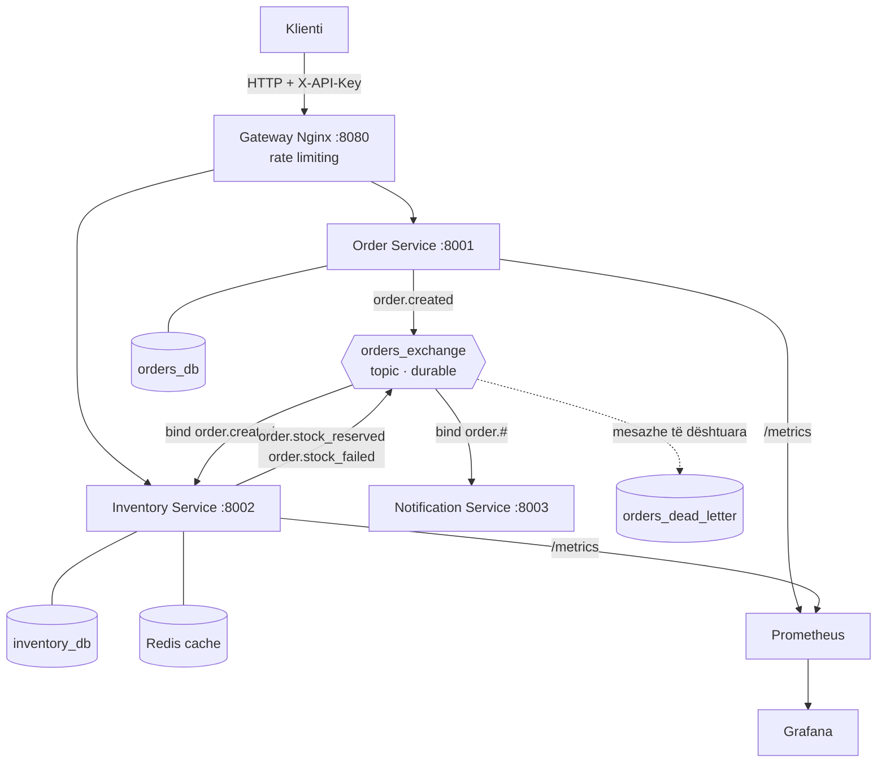
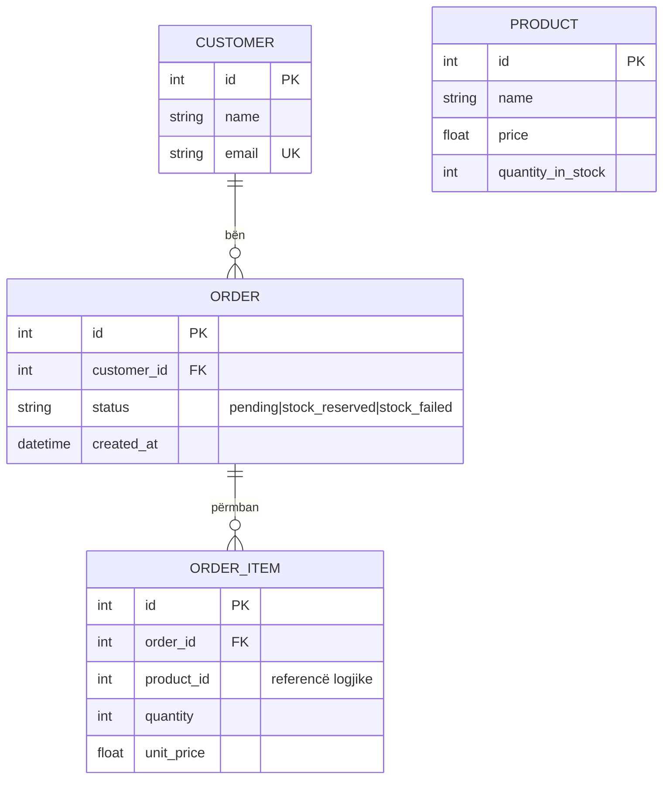
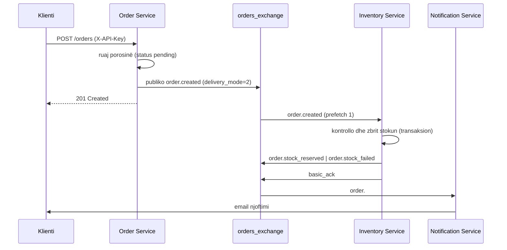

# Arkitektura e sistemit

## 1. Diagramë komponentësh

Pse kjo ndarje: pranimi i porosisë nuk duhet të varet nga kohëzgjatja e kontrollit të
stokut, dhe njoftimi i klientit nuk duhet të bllokojë asnjërën. Order Service nuk e njeh
Inventory Service — komunikimi kalon vetëm përmes event-eve, kështu që një konsumator i
re shtohet me një `queue_bind`, pa ndryshuar prodhuesin.

## 2. Modeli i të dhënave (ERD)

`CUSTOMER`, `ORDER` dhe `ORDER_ITEM` janë në `orders_db`; `PRODUCT` është në
`inventory_db`. Nuk ekziston foreign key ndër-bazë — `product_id` është referencë
logjike që transportohet në event. Kjo është ndarja sipas domain-it: secili shërbim
mund të shkallëzohet dhe migrohet i pavarur.

Integriteti: `email` është `unique`; `ORDER → ORDER_ITEM` ka
`cascade="all, delete-orphan"`; indekse në `orders.customer_id`,
`order_items.order_id` dhe `orders.status` (kolonat më të filtruara).

## 3. Rrjedha e një porosie

Përgjigjja 201 kthehet para se stoku të kontrollohet — kjo është arsyeja pse koha e
përgjigjes nuk varet nga Inventory Service.

## 4. Qëndrueshmëria

| Mekanizmi | Ku | Çfarë mbron |
| --- | --- | --- |
| `restart: on-failure` | docker-compose.yml | Rifillim automatik i kontejnerit |
| Healthcheck + `service_healthy` | docker-compose.yml | Nisje në rendin e duhur |
| Retry loop 5s | consumer.py | Brokeri mund të ngrihet më vonë |
| `delivery_mode=2` + radhë durable | messaging.py | Mesazhi mbijeton rinisjen e brokerit |
| `basic_ack` manual | consumer.py | Mesazhi hiqet vetëm pas suksesit |
| Dead Letter Queue | messaging.py | Mesazhet e dështuara ruhen për inspektim |
| `prefetch_count=1` | consumer.py | Ndarje e drejtë mes replikave |
| HPA (CPU/RAM + thellësi radhe) | k8s/hpa.yaml | Shkallëzim automatik nën ngarkesë |
